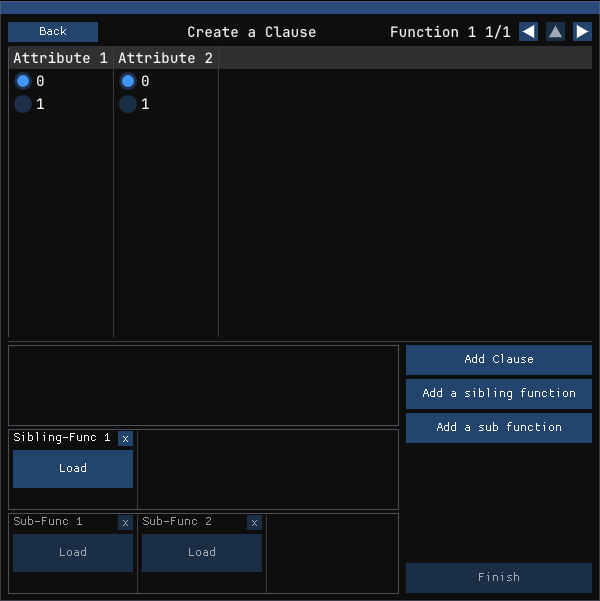

# UI Readme

## Introduction

MOEKA UI is the User Interface version of the MOEKA software. It
provides a visual representation of the Multiple Disk Form (MDF) created
by the MOEKA program and the functions contained inside of it. MOEKA UI
also allows for creating Functions and Clauses manually during runtime.

## Running the program

When you run the program, you will get a Window that looks like the one
below. Each Node is labeled with a number that corresponds to its
description.

1)  A window that contains buttons that manipulate the model, such as
    "Show bush up" and "Change expanded to real elements". As of
    writing, these buttons do not have functionality.

2)  When a Function is loaded into memory, a Tree view representation of
    the function and its sub functions, clauses, and sibling functions
    will appear below it in the hierarchy. There are also two buttons
    that will appear under the function when expanded labelled "Math"
    and "English" that will show the function as expressed through
    mathematical notation, and plain english.\
    \
    

3)  An introduction window that appears on first time start up, or by
    pressing the "Open Help" button. This window shows the keybinds
    involved in the program.

4)  This Window contains buttons to open up some of the commonly
    accessed windows, such as the Introduction window via "Open Help",
    the Preparation Window via "Open Prep", the Color Editor via "Edit
    Colors" and comparing two functions via "Compare Funcs"

5)  When a model is loaded, some widgets will populate this Window to
    affect the scaling of the currently focused model.\
    

6)  When there are multiple models loaded into memory, we can swap the
    selected model using the arrow buttons in this Window.

> Furthermore, If you hover a particular bar of data in a Model, you
> will be shown the bars class value, and you can right click to edit
> the color of the bar and other bars with the same class.
>
> 

## Prep Window

When opening the prep window, the program will have a handful of fields
pop up:

1)  The Functions name

2)  Function swapper, for changing the subject of the Prep Window to
    another function.

3)  A slider for the amount of target attributes for the function being
    created.

4)  A slider for the amount of attributes the function has.

5)  A number of sliders with an attached attribute name box will appear
    based on the amount of attributes specified via the Amount of
    Attributes slider. You can change the name of the attribute using
    the text box, and the maximum value the attribute can hold with the
    slider.

6)  A scrollable box containing all the attributes.

7)  Loads function/s from a file. If successful the program will remove
    current functions from memory before loading.

8)  If we already have a defined function in our program, and we do not
    wish to define a new function, the user can press Skip to go
    directly to the Function Screen without creating a new function.
    This option will be greyed out and unclickable if we do not have any
    loaded functions.

9)  Add func will add the function to the programs memory and move into
    the Function Screen.

10) If clicked it will use the function created and step into the
    Interview Screen.

## Function Screen

When in this screen, we will see the following:

1)  A button to go back to the previous screen.

2)  If we have multiple loaded functions, pressing the left and right
    arrow will swap the focus between them here. If we are loaded into a
    sub-function, we will also gain the use of the up arrow to go into
    the parent function.

3)  Each attribute defined in the previous window using Amount of
    Attributes will appear in this table, with radio buttons equal to
    the amount specified in the slider relating to the attribute. The
    selected values is for the next clause to be added. If a clause was
    loaded, then that clauses values will be displayed instead.

4)  A box that contains all the Clauses that this function contains.
    Pressing Load will change the focus of the Table above, while
    pressing X will delete the clause.\
    

5)  A box that contains all the Sibling functions this function has,
    which is pre-calculated using the value of "Amount of Target
    Attributes" minus 1.\
    

6)  A box that contains all the sub functions this function has, which
    is pre-calculated using the value of "Amount of Attributes". The sub
    functions come undefined until the user defines them.\
    

7)  The button to add a clause to the function. This button changes to
    "Update Clause" when a clause has been loaded into memory, for
    clarity.

8)  Adds a sibling function to the function. This button is not entirely
    necessary when the sibling functions are already pre-calculated.

9)  Attaches a sub function definition to this function at a specified
    attribute. Select the attribute to add the definition for, then
    press Select. The program will load into that subfunction
    automatically.\
    

10) Finish up the Function screen and create a model of the function.
    This button is greyed out if there is no defined clauses.

## Interview Screen

In this screen, the user will be asked questions about the function
instead of manually applying values. The user must answer all questions
before continuing forwards.

Then, the user will be asked for values of individual datapoints. Once
all the answers have been collected a model will generate.

## Color Editor

In this screen, the user can set the individual colors of each class for
a model. They can also instead click the "use gradient instead?" button
to create a gradient from one color to another.

Compare Screen:
In this screen, the user can select two loaded functions. If they can be
compared, it will compare the clauses of each function and create a
model that highlights the differences.
